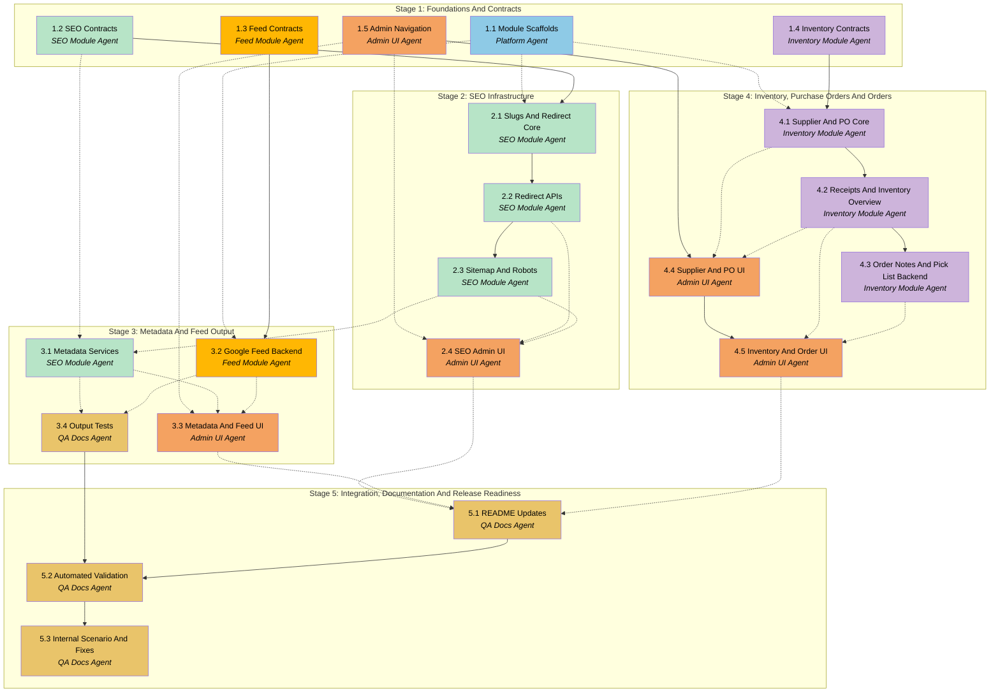

---

## title: MercFlow Batch 2
modified: Plan creation by the Planner.

# APM Plan

## Workers

| Worker                 | Domain                                           | Description                                                                                                                                                                      |
| ---------------------- | ------------------------------------------------ | -------------------------------------------------------------------------------------------------------------------------------------------------------------------------------- |
| Platform Agent         | Backend platform and integration                 | Creates package scaffolds, backend module registration, route re-export patterns, shared build/typecheck integration, and migration/tooling conventions for new Batch 2 modules. |
| SEO Module Agent       | SEO infrastructure                               | Implements slugging, redirects, sitemap, robots, canonical URL, Open Graph, and JSON-LD backend services and routes.                                                             |
| Feed Module Agent      | Google Shopping XML feed                         | Implements Google Shopping XML configuration, generation, validation, caching, and feed-specific admin APIs.                                                                     |
| Inventory Module Agent | Inventory, purchase orders, and order extensions | Implements suppliers, purchase orders, receipt history, incoming inventory, inventory overview data, internal order notes, and pick-list backend support.                        |
| Admin UI Agent         | Admin interface                                  | Implements Batch 2 navigation, pages, tables, forms, previews, loading/error states, and operator workflows using existing admin UI patterns and design tokens.                  |
| QA Docs Agent          | Verification and documentation                   | Updates README documentation, expands automated checks, validates public output formats, and performs the final internal scenario pass.                                          |

## Stages

| Stage | Name                                             | Tasks | Agents                                                                                                     |
| ----- | ------------------------------------------------ | ----- | ---------------------------------------------------------------------------------------------------------- |
| 1     | Foundations And Contracts                        | 5     | Platform Agent, SEO Module Agent, Feed Module Agent, Inventory Module Agent, Admin UI Agent                |
| 2     | SEO Infrastructure                               | 4     | SEO Module Agent, Platform Agent, Admin UI Agent                                                           |
| 3     | Metadata And Feed Output                         | 4     | SEO Module Agent, Feed Module Agent, Admin UI Agent, QA Docs Agent                                         |
| 4     | Inventory, Purchase Orders And Orders            | 5     | Inventory Module Agent, Admin UI Agent                                                                     |
| 5     | Integration, Documentation And Release Readiness | 3     | QA Docs Agent, Platform Agent, SEO Module Agent, Feed Module Agent, Inventory Module Agent, Admin UI Agent |

## Dependency Graph

---

> **Notes:** The critical path runs through package/module scaffolding, backend domain contracts, public output routes, admin workflows, and final integrated validation. Stages are sequential milestone groups, but many Tasks inside a Stage can be dispatched in parallel once their direct dependencies are met. Backend Tasks produce contracts and route behavior that Admin UI Tasks consume. Stage boundaries after Stage 2, Stage 3, and Stage 4 are natural points for the Manager to consider holistic checks because they introduce crawler output, feed output, and operations workflows respectively.

## Stage 1: Foundations And Contracts

### Task 1.1: Module Scaffolds And Backend Integration - Platform Agent

- **Objective:** Establish the new Batch 2 package and backend integration foundations for `seo-module`, `feed-module`, and `inventory-module`.
- **Output:** New package scaffolds, package READMEs, root workspace/script integration, backend module registration pattern, app route re-export conventions, and migration tooling notes for each new module.
- **Validation:** `pnpm install` remains valid without workspace errors; root `pnpm typecheck` includes all new packages; backend config can resolve all new modules; package-local README files exist; no Medusa core or `node_modules` files are modified.
- **Guidance:** Follow the existing `packages/content-module` structure for Medusa module packages, DML model locations, service exports, migrations, integration route exports, and backend app route re-exports. Keep app-level code thin and put business logic in modules. Do not generate final migrations before the relevant model definitions are implemented and confirmed by the domain Tasks.
- **Dependencies:** None

1. Inspect `packages/content-module`, `apps/backend/medusa-config.ts`, and backend route re-export files to confirm the current canonical module integration pattern.
2. Create package scaffolds for `@mercflow/seo-module`, `@mercflow/feed-module`, and `@mercflow/inventory-module` with TypeScript configuration, package exports, minimal module entrypoints, and smoke tests.
3. Register the new workspace packages in backend dependencies and `apps/backend/medusa-config.ts` without adding business behavior yet.
4. Add package-local README files explaining responsibility, isolated run/test commands, conventions, and what does not belong in each package.
5. Update root scripts only as needed so typecheck/build/test coverage does not miss the new packages.

### Task 1.2: SEO Domain Contracts And Schema Plan - SEO Module Agent

- **Objective:** Define the SEO module's data contracts, service boundaries, and API contracts before implementing behavior.
- **Output:** SEO module model definitions or model plan for redirects, sitemap config, robots config, slug settings, metadata settings, route contracts, and validation schemas.
- **Validation:** Contracts cover all SEO PRD requirements and Spec decisions; `ø -> o`, `æ -> ae`, and `å -> aa` are documented in code-facing contracts; route contracts include content types for public output; no duplicate ownership of `content-module` SEO fields is introduced.
- **Guidance:** Use the approved Spec sections on SEO infrastructure, slug generation, and public/admin API surface. Keep redirects, sitemap, robots, slug settings, and metadata configuration in `seo-module`. Treat `content-module` SEO fields as read-only source data from this module's perspective.
- **Dependencies:** **Task 1.1 by Platform Agent**

1. Confirm current content field names and service access patterns in `packages/content-module`.
2. Draft DML model shapes and TypeScript types for redirects, sitemap config, robots config, and slug/metadata settings.
3. Define Zod validation schemas for admin redirect/config endpoints.
4. Define public output route contracts for `GET /sitemap.xml` and `GET /robots.txt`, including status codes and content types.
5. Add lightweight tests or type assertions that lock the slug rule constants and public contract types.

### Task 1.3: Feed Domain Contracts And Schema Plan - Feed Module Agent

- **Objective:** Define Google Shopping XML feed configuration, validation, and output contracts.
- **Output:** Feed module model definitions or model plan for feed config, exclusion rules if needed, validation result shapes, XML output contract, and admin API schemas.
- **Validation:** Contracts use the name "Google Shopping XML"; no external platform connection is required; validation result shape can report missing required fields; feed field sources align with Medusa catalog and `content-module` data.
- **Guidance:** Use the approved Spec section on Google Shopping XML Feed. Keep platform toggles out of scope. The feed may be usable elsewhere, but names, routes, and docs should present the feature as Google Shopping XML.
- **Dependencies:** **Task 1.1 by Platform Agent**, **Task 1.2 by SEO Module Agent**

1. Map feed fields from `.cursor/docs/PRD-batch2.md` to Medusa data, `content-module` data, and feed-module configuration.
2. Define DML model shapes and TypeScript types for feed configuration and validation reports.
3. Define admin routes for feed overview, validation report, config update, and manual regeneration if needed.
4. Define the public `GET /feed/google-shopping.xml` contract including content type, caching behavior, and error behavior.
5. Add type-level or unit-level checks for required feed fields and validation result structure.

### Task 1.4: Inventory And Order Domain Contracts And Schema Plan - Inventory Module Agent

- **Objective:** Define inventory-module data contracts for suppliers, purchase orders, receipts, low stock config, internal order notes, and pick-list support.
- **Output:** Model definitions or model plan for supplier, purchase order, purchase order line, purchase order receipt, inventory config, and order notes; API schemas for supplier/PO/receipt/inventory/order-note routes.
- **Validation:** PO statuses match the Spec; receipt contracts do not mutate Medusa stock; UI-facing response shapes can distinguish Medusa stocked/reserved data from MercFlow incoming/received data; internal notes are clearly non-customer-facing.
- **Guidance:** Use Medusa order/inventory data as source data, not ownership transfer. MercFlow owns operational extension data. Do not add automatic low stock ordering, EDI, or stock mutation behavior.
- **Dependencies:** **Task 1.1 by Platform Agent**

1. Define DML model shapes and TypeScript types for suppliers, POs, PO lines, receipts, low stock config, and order notes.
2. Define status transition rules for `draft`, `ordered`, `partially_received`, `received`, and `cancelled`.
3. Define admin route contracts for supplier CRUD, PO list/create/detail/update/receive, inventory overview, order notes, and pick lists.
4. Define how response shapes expose "received but not applied to Medusa stock" boundaries.
5. Add initial validation tests for status constants and receipt input shapes.

### Task 1.5: Batch 2 Admin Navigation And Shared Page Patterns - Admin UI Agent

- **Objective:** Establish the admin navigation structure and reusable page patterns for Batch 2 admin areas.
- **Output:** Admin navigation updates, placeholder routes/pages for SEO/Feeds, Inventory, and Orders enhancements, shared page/table/form patterns where needed, and route-based heading strategy if required.
- **Validation:** New navigation is keyboard accessible; routes load without runtime errors; placeholders use design tokens and explicit loading/error/empty state patterns where applicable; no arbitrary Tailwind values or hardcoded design values are introduced.
- **Guidance:** Follow `packages/admin-ui/src/App.tsx`, `AdminShell`, `AppSidebar`, list primitives, and Batch 1 content page patterns. SEO and Feeds may share a navigation area. Inventory should feel like an inventory operations area with subpages. Orders should remain Orders and be improved in place.
- **Dependencies:** **Task 1.1 by Platform Agent**

1. Inspect current routing, sidebar, list primitives, and content page patterns.
2. Add route placeholders for Batch 2 areas without implementing backend-dependent behavior prematurely.
3. Update navigation with a simple, coherent information architecture for SEO/Feeds, Inventory, and Orders.
4. Establish shared page header, toolbar, table, preview, and form patterns needed by later Batch 2 UI Tasks.
5. Add smoke checks for route rendering where the existing test setup supports it.

## Stage 2: SEO Infrastructure

### Task 2.1: Nordic Slug Utility And Redirect Core - SEO Module Agent

- **Objective:** Implement the SEO module's slug-generation utility and redirect domain service.
- **Output:** Slug utility, redirect DML model and migration, redirect service methods, redirect validation, redirect-chain detection logic, and unit tests.
- **Validation:** Unit tests cover `ø -> o`, `æ -> ae`, `å -> aa`, accents, spaces, special characters, duplicate/invalid redirect inputs, and redirect-chain warnings; migration includes a decision log; service uses Medusa errors for service-layer failures.
- **Guidance:** Follow the approved Spec sections on slug generation and SEO infrastructure. Existing slugs are not changed automatically. Bulk regeneration remains an explicit admin action and should create redirects for changed known URLs once implemented.
- **Dependencies:** Task 1.2 by SEO Module Agent, **Task 1.1 by Platform Agent**

1. Implement slug utility constants and functions with the approved Nordic rules.
2. Implement redirect DML model and generate the module migration with a decision log.
3. Implement redirect service methods for create/list/search/filter/delete and chain detection.
4. Add validation schemas for redirect creation/import inputs.
5. Add service and utility tests covering slugging and redirect edge cases.

### Task 2.2: Redirect APIs And Public Redirect Handling - SEO Module Agent

- **Objective:** Expose redirect management APIs and public redirect handling through the backend.
- **Output:** Admin redirect list/create/delete/import routes, backend route re-exports, public redirect middleware or route handling, and automatic redirect creation hook/subscriber where Medusa event behavior is verified.
- **Validation:** Admin route tests cover list/create/delete/import validation; public redirect tests return 301 and `Location` for known redirects; unmatched URLs continue normally; automatic redirect tests or documented smoke checks verify product/category URL-change behavior if implemented.
- **Guidance:** Keep wildcard and regex redirects out of scope. If Medusa subscriber/event payloads cannot reliably expose old and new URL values, implement manual redirects and document automatic redirect as a follow-up blocker rather than guessing.
- **Dependencies:** Task 2.1 by SEO Module Agent, **Task 1.1 by Platform Agent**

1. Implement admin API routes for redirect management using Zod validation and service delegation.
2. Implement CSV import parsing through structured validation rather than ad hoc string handling.
3. Implement public 301 behavior for exact known source URLs.
4. Research and verify Medusa product/category update event payloads before adding automatic redirect creation.
5. Add route tests for success, validation errors, 301 behavior, and pass-through behavior.

### Task 2.3: Sitemap And Robots Backend Output - SEO Module Agent

- **Objective:** Implement dynamic sitemap and robots.txt generation with admin-controlled configuration.
- **Output:** Sitemap config model/service/routes, robots config model/service/routes, public `GET /sitemap.xml`, public `GET /robots.txt`, preview/regenerate admin routes, caching/invalidation hooks where feasible, and tests.
- **Validation:** Public routes return correct content types and valid XML/text; admin preview matches public output; manual regenerate updates timestamp or cache state; excluded products/categories are omitted; route tests cover empty catalog and configured exclusions.
- **Guidance:** On-demand generation with caching and manual regenerate is acceptable. Sitemap index, image sitemap, news sitemap, and advanced robots automation are out of scope. Pull catalog/category data from Medusa through supported query/service APIs.
- **Dependencies:** Task 2.2 by SEO Module Agent, **Task 1.1 by Platform Agent**

1. Implement sitemap and robots DML models/config defaults and generate migrations with decision logs.
2. Implement services for config retrieval/update, XML/text generation, preview, regenerate, and last-updated state.
3. Add public backend route re-exports for `/sitemap.xml` and `/robots.txt`.
4. Add admin routes for config, preview, and regenerate actions.
5. Add tests for output correctness, content types, config validation, and cache/regenerate behavior.

### Task 2.4: SEO Admin Pages For Redirects, Sitemap And Robots - Admin UI Agent

- **Objective:** Build operator-ready admin UI for redirect management, sitemap control, and robots.txt control.
- **Output:** Redirect list/search/filter/create/delete/import UI, redirect-chain warning display, sitemap settings/preview/regenerate UI, robots structured/free-text editor, loading/error/empty states, and admin smoke tests.
- **Validation:** UI uses design tokens and existing list/form primitives; keyboard navigation works for primary actions; API errors are visible; previews render output returned by backend; delete/import actions are confirmed appropriately; route smoke tests pass.
- **Guidance:** Keep UI simple and work-ready. Use dedicated pages for complex flows and modals only for confirmations or short focused actions. Do not implement wildcard/regex redirect UI.
- **Dependencies:** **Task 2.2 by SEO Module Agent**, **Task 2.3 by SEO Module Agent**, Task 1.5 by Admin UI Agent

1. Implement redirect overview page using shared list primitives and backend APIs.
2. Implement redirect create/delete/import flows with validation feedback.
3. Implement sitemap settings page with include/exclude controls, preview, regenerate, and last-updated display.
4. Implement robots editor with structured controls, free-text mode, sitemap reference, and preview.
5. Add admin UI smoke tests for navigation and primary states.

## Stage 3: Metadata And Feed Output

### Task 3.1: Structured Metadata Services - SEO Module Agent

- **Objective:** Implement canonical URL, Open Graph, Twitter card, JSON-LD Product, BreadcrumbList, Organization, and WebSite generation services.
- **Output:** Metadata service APIs, settings/config models if needed, admin routes for settings/preview, generated data structures for storefront consumption, and tests.
- **Validation:** Tests cover fallback logic from SEO fields to Medusa titles/descriptions, product/category metadata, Organization/WebSite settings, canonical override behavior where content supports it, and invalid/missing data handling.
- **Guidance:** Generate metadata from Medusa core plus `content-module` data. Do not introduce manual JSON editing. If canonical override requires adding fields to existing content models, stop for explicit review because that changes content model fields and may require migrations.
- **Dependencies:** Task 1.2 by SEO Module Agent, Task 2.3 by SEO Module Agent

1. Implement metadata data types and service methods for product, category, organization, and website metadata.
2. Integrate with `content-module` service/API patterns for SEO title, description, OG image, and media gallery data.
3. Implement settings and preview admin routes for Organization/WebSite and page-level previews.
4. Add tests for JSON-LD shape, OG/Twitter fallback behavior, and canonical URL calculation.
5. Document any content-model limitation or required follow-up before adding new fields.

### Task 3.2: Google Shopping XML Backend - Feed Module Agent

- **Objective:** Implement Google Shopping XML feed generation, validation, configuration, and public feed output.
- **Output:** Feed config DML/migration, feed service, validation service, admin APIs, public `GET /feed/google-shopping.xml`, caching/regenerate support, and tests.
- **Validation:** Public feed route returns valid XML and correct content type; validation reports missing required fields; product/category exclusions work where implemented; feed uses `seo_description` and media gallery from `content-module`; no external platform connection is required.
- **Guidance:** Use the approved Spec's Google Shopping XML scope. Keep Amazon, Pricerunner, Meta/TikTok-specific toggles, and paid feed-management features out of scope. Treat Medusa pricing/inventory access as implementation research if current repo patterns do not show enough.
- **Dependencies:** Task 1.3 by Feed Module Agent, **Task 3.1 by SEO Module Agent**, **Task 1.1 by Platform Agent**

1. Implement feed config and exclusion models and generate migrations with decision logs.
2. Implement feed generation from Medusa catalog/variant/pricing/inventory and MercFlow content fields.
3. Implement validation report generation for missing required feed fields.
4. Implement admin APIs for overview, config, validation report, and regenerate.
5. Implement public feed route and tests for XML structure, content type, validation, caching, and edge cases.

### Task 3.3: Metadata Preview And Feed Admin UI - Admin UI Agent

- **Objective:** Build admin UI for structured metadata previews, Organization/WebSite settings, and Google Shopping XML feed management.
- **Output:** Metadata settings/preview UI, social preview UI where applicable, feed overview page, feed validation report UI, feed URL display, regenerate action, exclusion controls where supported, and smoke tests.
- **Validation:** UI clearly labels Google Shopping XML; validation issues are actionable; metadata previews reflect backend output; loading/error states are explicit; no external platform connection is shown as required; design tokens and existing components are used.
- **Guidance:** Keep SEO and Feeds in a coherent shared navigation area. Prioritize simple controls, previews, validation reports, and clear copy over advanced dashboards.
- **Dependencies:** **Task 3.1 by SEO Module Agent**, **Task 3.2 by Feed Module Agent**, Task 1.5 by Admin UI Agent

1. Implement metadata settings and preview pages using backend preview APIs.
2. Implement feed overview with product count, last generated timestamp, validation status, and feed URL.
3. Implement validation report UI with filters for missing required fields.
4. Implement regenerate and exclusion controls where backend support exists.
5. Add route smoke tests and interaction tests for key feed/metadata states.

### Task 3.4: Feed And SEO Output Tests - QA Docs Agent

- **Objective:** Add cross-domain automated tests for SEO metadata output and Google Shopping XML output.
- **Output:** Backend tests or integration tests covering public XML/text/JSON-like metadata outputs, feed validation behavior, and representative empty/error states.
- **Validation:** Tests fail on invalid XML/text content types, missing required feed fields, incorrect slug rules, broken metadata fallbacks, and unexpected public route failures; tests run in the documented local command set.
- **Guidance:** Focus on output correctness rather than external platform validation. Use local fixtures/mocks where full Medusa catalog setup is too heavy, but keep route-level tests where feasible.
- **Dependencies:** **Task 3.1 by SEO Module Agent**, **Task 3.2 by Feed Module Agent**

1. Identify the most reliable test layer for each public output route and metadata service.
2. Add fixtures or factories for representative product, category, content, inventory, and feed validation data.
3. Add tests for `/sitemap.xml`, `/robots.txt`, `/feed/google-shopping.xml`, and metadata service output.
4. Ensure test commands are wired into package or root validation.
5. Report any outputs that require manual validation because automated setup is not yet practical.

## Stage 4: Inventory, Purchase Orders And Orders

### Task 4.1: Supplier And Purchase Order Backend Foundation - Inventory Module Agent

- **Objective:** Implement supplier registry and purchase order core backend behavior.
- **Output:** Supplier, purchase order, and purchase order line models/migrations, services, admin APIs, validation schemas, and tests.
- **Validation:** Supplier CRUD works; POs can be created, listed, filtered, and moved through allowed status transitions; invalid status transitions are rejected; migrations include decision logs; purchase prices and references are stored without Guapo-specific assumptions.
- **Guidance:** Use the approved Spec's PO status model. Keep supplier integration, EDI, invoice matching, and automatic low-stock ordering out of scope.
- **Dependencies:** Task 1.4 by Inventory Module Agent, **Task 1.1 by Platform Agent**

1. Implement supplier, purchase order, and purchase order line DML models.
2. Generate migrations with decision logs.
3. Implement services for supplier CRUD, PO creation, listing/filtering/search, line management, and status transitions.
4. Implement admin routes with Zod validation.
5. Add service and route tests for supplier and PO core behavior.

### Task 4.2: PO Receipts, Incoming Quantities And Inventory Overview Services - Inventory Module Agent

- **Objective:** Implement PO receipt history, incoming quantity calculations, low stock configuration, and inventory overview data.
- **Output:** Receipt and inventory config models/migrations, receipt service, incoming quantity service, inventory overview route, low stock config routes, and tests.
- **Validation:** Partial receipt updates PO status correctly; received quantities do not mutate Medusa stock; variances are visible in service responses; incoming quantity only includes open ordered quantities; low stock thresholds work with default and per-variant config.
- **Guidance:** Make the "MercFlow receipt does not apply to Medusa stock yet" boundary explicit in service response fields. Available quantity should be a live calculation from Medusa data where available, not cached.
- **Dependencies:** Task 4.1 by Inventory Module Agent

1. Implement purchase order receipt and inventory config models and migrations.
2. Implement receipt recording with partial/complete receipt status handling.
3. Implement incoming quantity calculations by variant.
4. Implement inventory overview service combining Medusa stock/reserved data with MercFlow incoming data.
5. Add tests for receipt rules, incoming calculations, low stock thresholds, and no Medusa stock mutation.

### Task 4.3: Internal Order Notes And Pick List Backend - Inventory Module Agent

- **Objective:** Implement MercFlow-owned order operations extensions on top of Medusa order data.
- **Output:** Internal order note model/migration, order note services/routes, order timeline data aggregation where available, pick-list generation route, and tests.
- **Validation:** Internal notes are stored and retrieved by order ID; notes are not customer-facing; pick list groups ready-to-ship order items from Medusa data where available; print-friendly output data is deterministic; invalid order IDs return explicit errors.
- **Guidance:** Medusa owns core order/payment/fulfillment data. MercFlow owns only internal operational extension data and derived views. Shipping label generation and track-and-trace emails are out of scope.
- **Dependencies:** Task 4.2 by Inventory Module Agent

1. Implement order note model and migration with decision log.
2. Implement order notes service and admin routes.
3. Implement timeline aggregation service using Medusa order/fulfillment/payment data where available.
4. Implement pick-list data generation for orders ready to ship.
5. Add tests for notes, timeline fallbacks, and pick-list output.

### Task 4.4: Supplier And PO Admin Workflows - Admin UI Agent

- **Objective:** Build admin UI for suppliers, purchase orders, PO detail, and receipt registration.
- **Output:** Supplier list/create/edit UI, PO list/create/detail UI, line item editor, receive flow, variance display, status badges, loading/error/empty states, and smoke tests.
- **Validation:** Operators can create suppliers and POs, add variants/quantities/prices, record partial and full receipts, see variance warnings, and see clear copy that receipt does not apply to Medusa stock; UI uses design tokens and accessible form patterns.
- **Guidance:** Keep forms page-based when they have more than four fields. Use modals only for short confirmations. Follow Batch 1 page/list patterns and explicit error handling.
- **Dependencies:** **Task 4.1 by Inventory Module Agent**, **Task 4.2 by Inventory Module Agent**, Task 1.5 by Admin UI Agent

1. Implement supplier list and supplier form pages.
2. Implement PO list with status/supplier/date/search filters.
3. Implement PO create/detail pages with line item editing and status display.
4. Implement receive flow with partial receipt and variance UI.
5. Add admin smoke tests and focused tests for receipt boundary copy.

### Task 4.5: Inventory Dashboard And Order Operations Admin UI - Admin UI Agent

- **Objective:** Build admin UI for inventory overview, low stock alerts, order improvements, internal notes, timeline, and pick list.
- **Output:** Inventory dashboard table, low stock views, variant movement/history panel where backend data exists, improved orders list/detail areas, internal order notes UI, timeline display, print-friendly pick-list UI, and smoke tests.
- **Validation:** Dashboard shows stocked/reserved/available/incoming with clear labels; low stock filters work; order notes can be created and displayed; pick list is printable; missing backend data uses explicit empty/error states; UI does not imply PO receipts have changed Medusa stock.
- **Guidance:** Inventory should feel like a natural extension of inventory operations. Orders should remain Orders and improve existing workflows rather than introducing a disconnected order domain.
- **Dependencies:** **Task 4.2 by Inventory Module Agent**, **Task 4.3 by Inventory Module Agent**, Task 4.4 by Admin UI Agent

1. Implement inventory overview page with search, sorting, filters, and low stock controls.
2. Implement inventory detail/history surfaces where backend data is available.
3. Implement improved order list/detail UI surfaces using Medusa and MercFlow extension APIs.
4. Implement internal notes UI and timeline display.
5. Implement pick-list page with print-friendly layout and smoke tests.

## Stage 5: Integration, Documentation And Release Readiness

### Task 5.1: Package And App README Updates - QA Docs Agent

- **Objective:** Update documentation for all new Batch 2 modules, backend integration, and admin flows.
- **Output:** README updates for `seo-module`, `feed-module`, `inventory-module`, `admin-ui`, and `apps/backend` where responsibilities or commands changed.
- **Validation:** READMEs explain package responsibility, isolated run/test commands, key conventions, out-of-scope boundaries, migration workflow where relevant, public/admin route references, and the PO receipt boundary; docs contain no Guapo production configuration or secrets.
- **Guidance:** Keep package documentation in package-local READMEs. Do not create extra package-level markdown files unless explicitly needed. Use English technical documentation.
- **Dependencies:** **Task 2.4 by Admin UI Agent**, **Task 3.3 by Admin UI Agent**, **Task 4.5 by Admin UI Agent**

1. Review all new modules and app-level route integration points.
2. Update package READMEs with responsibilities, run/test commands, field definitions, route references, migration workflow, and out-of-scope notes.
3. Update `packages/admin-ui/README.md` with Batch 2 navigation and UI conventions.
4. Update `apps/backend/README.md` with module registration and public output routes.
5. Verify documentation matches implemented behavior and approved scope.

### Task 5.2: Cross-Domain Automated Validation - QA Docs Agent

- **Objective:** Run and complete automated validation across Batch 2 packages and app integration.
- **Output:** Passing typecheck, tests, builds where relevant, migration run evidence for local development, and fixes or reports for discovered issues.
- **Validation:** `pnpm typecheck`, relevant package tests, backend build/typecheck, admin UI smoke tests, and migration run commands pass locally or have documented blockers; no introduced lint/type/test failures remain unaddressed where the fix is clear.
- **Guidance:** Use the most relevant validation for changed code rather than only root smoke tests. Avoid production/staging databases. If a validation command cannot run because of missing local services, document the blocker and the exact command that should be run.
- **Dependencies:** Task 5.1 by QA Docs Agent, Task 3.4 by QA Docs Agent

1. Run targeted package tests for SEO, feed, inventory, backend, and admin UI.
2. Run root typecheck and build where feasible.
3. Run local migration generation/run validation against a local development database where available.
4. Fix clear issues in the responsible package or coordinate with the relevant domain Worker through the Manager.
5. Produce a concise validation report with commands, pass/fail status, and unresolved blockers.

### Task 5.3: Manual Guapo-Style Internal Scenario And Fixes - QA Docs Agent

- **Objective:** Validate Batch 2 as a functional internal version through a realistic end-to-end operator scenario.
- **Output:** Manual scenario report, discovered issue fixes or follow-up notes, and final readiness assessment.
- **Validation:** Scenario covers redirect creation/use, slugging, sitemap preview/output, robots preview/output, metadata preview, Google Shopping XML validation/output, supplier creation, PO creation, partial/full receipt, inventory dashboard incoming visibility, order note creation, and pick-list generation.
- **Guidance:** This is a Guapo-style scenario, not Guapo-specific code. Do not use production credentials or production databases. User involvement is required only for subjective acceptance of internal usability or if local data/account access is unavailable.
- **Dependencies:** Task 5.2 by QA Docs Agent, **Task 2.4 by Admin UI Agent**, **Task 3.3 by Admin UI Agent**, **Task 4.5 by Admin UI Agent**

1. Prepare local sample data or identify existing local development data needed for the scenario.
2. Execute the scenario through admin UI and backend public routes.
3. Capture issues with reproduction steps, affected package, and severity.
4. Fix clear blocking issues or hand them back to the responsible domain through the Manager.
5. Summarize readiness, residual risks, and any external validation intentionally deferred out of Batch 2.

