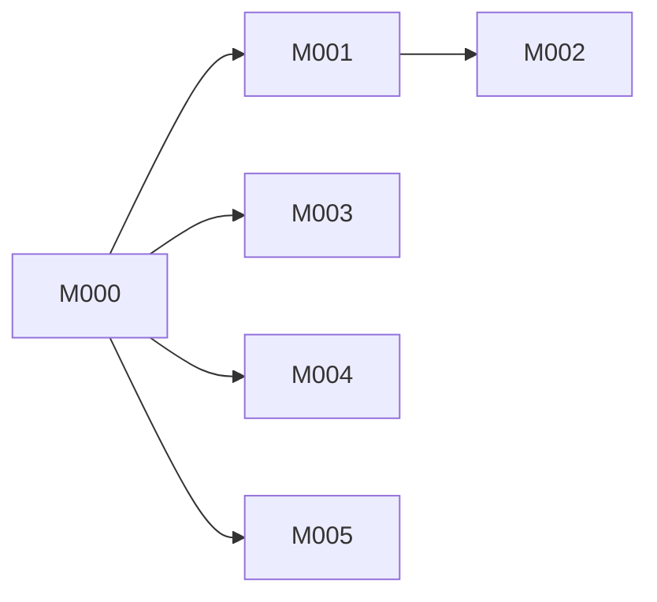

# Milestones — MercFlow Batch 2

> Ordered deliveries. Each milestone groups one or more sprints.
> Updated: 2026-06-04 (synced with `development`; see `.factory/logs/milestone-reviews/M000-2026-06-04.md`)

---

## Vision

MercFlow becomes a complete SaaS Medusa distribution: multiple shops run on one shared backend, each fully isolated by `store_id`. Every shop gets auto-maintained SEO infrastructure (redirects, sitemap, robots, structured data, Nordic slugs), a validated shopping feed for Google/Meta/TikTok, full purchase order and inventory management, and an improved order admin — all without touching code.

---

## Milestone overview

| ID | Title | Outcome | Depends on | Status |
|----|-------|---------|------------|--------|
| M000 | Tenancy Foundation | SaaS isolation safe; ready for second tenant | — | reviewed (yellow) |
| M001 | SEO Infrastructure | Redirects, sitemap, robots, slug utility live | M000 | in progress |
| M002 | SEO Metadata | JSON-LD, OG, canonical on all pages | M001 | planned |
| M003 | Shopping Feed | Google/Meta/TikTok feed live and validated | M000 | in progress |
| M004 | Inventory & Purchase Orders | Full PO lifecycle + inventory dashboard | M000 | planned |
| M005 | Improved Order Flow | Faster order processing + pick list | M000 | in progress |

---

## M000 — Tenancy Foundation

**Outcome:** All MercFlow-owned tables have `store_id NOT NULL` + RLS. Guapo backfilled. Rate limiting active on public routes. Safe to onboard a second tenant.

**Progress (2026-06-04):** S001 done — T001 (#50), T002 (#52), T003 (#53). `/milestone-review M000` recorded (yellow): [review log](../logs/milestone-reviews/M000-2026-06-04.md). **Open:** Neon IP allowlist HITL — [checklist](../logs/hitl/M000-neon-allowlist.md). `shipmondo_enabled_products` backfill deferred (table optional / prod-only; not in T001 migration).

**Sprints in this milestone:**

| Sprint | Goal | Tasks |
|--------|------|-------|
| S001 | Backfill + RLS + rate limiting | T001, T002, T003 |

**Dependencies:** none — this is the root blocker.

**Guapo store_id:** `store_01KG0VBTT0714XV2CCTEBRVC47`

**Tables in scope (medusa schema):**

*MercFlow Batch 1 (10):* `article`, `category_content`, `product_content`, `cms_redirect`, `cms_global`, `media_asset`, `page`, `page_block`, `page_version`, `product_attribute`, `product_attr_link`

*Guapo-custom (7):* `brand`, `product_product_brand_brand`, `product_review`, `product_review_image`, `product_review_response`, `product_review_stats`, `guapo_free_shipping_setting`, `shipmondo_enabled_products`

Note: `payload.*` schema (PayloadCMS, Guapo storefront) is excluded — it is Guapo-specific, single-tenant by nature, not managed by MercFlow.

**Definition of done:**
- [x] All 17+ tables have `store_id NOT NULL` + composite index (11 MercFlow + 6 Guapo-custom in migration; `shipmondo_enabled_products` follow-up if present in prod)
- [x] All 4 broken unique indexes rebuilt with `store_id`
- [x] RLS enabled + `tenant_isolation` policy on all MercFlow tables
- [x] Rate limiting returns `429` after threshold on public + store routes
- [x] `pnpm migration:run` clean on local (inferred; PR #50/#52 merged, tenancy tests green)
- [x] `/milestone-review M000` recorded — **yellow** until Neon HITL closed
- [ ] Neon IP allowlist (T003 HITL) — human; see [hitl/M000-neon-allowlist.md](../logs/hitl/M000-neon-allowlist.md)

---

## M001 — SEO Infrastructure

**Outcome:** Slug changes auto-create 301 redirects. Sitemap and robots.txt fully admin-controlled. Nordic characters produce clean URLs.

**Progress (2026-06-04):** S002 merged on `development` via PR #55 (`b378e22`) — seo-module, slug strategy, redirect middleware/subscribers, admin UI. S003 (sitemap, robots, T008 tenant middleware) not started.

**Sprints in this milestone:**

| Sprint | Goal | Tasks |
|--------|------|-------|
| S002 | seo-module + slug + redirects | T004, T005, T006, T007 |
| S003 | Sitemap + robots + public tenant routing | T008, T009, T010, T011, T012 |

**Dependencies:** M000

**Definition of done:**
- [ ] `GET /sitemap.xml` and `GET /robots.txt` return tenant-scoped data based on `Host` header
- [ ] Slug change on product → 301 redirect auto-created
- [ ] Nordic slug strategy configurable per tenant in Settings
- [ ] All public routes return `404` if tenant not resolved
- [ ] `/milestone-review M001` green

---

## M002 — SEO Metadata

**Outcome:** Structured data (JSON-LD), Open Graph, and canonical tags generated automatically on all product and category pages.

**Sprints in this milestone:**

| Sprint | Goal | Tasks |
|--------|------|-------|
| S004 | JSON-LD + OG + canonical + global config | T013, T014, T015, T016 |

**Dependencies:** M001 (seo-module foundation, tenant resolution)

**Definition of done:**
- [ ] JSON-LD `Product` + `BreadcrumbList` + `Organization` + `WebSite` blocks generated per tenant
- [ ] OG tags populated from SEO fields with fallbacks
- [ ] Canonical auto-set; manual override works
- [ ] No cross-tenant org data in any response
- [ ] `/milestone-review M002` green

---

## M003 — Shopping Feed

**Outcome:** Auto-maintained Google Shopping XML feed per tenant. Validated, tenant-scoped, cache-invalidated on catalogue changes.

**Progress (2026-06-04):** S005 merged — PR #54 (scaffold), #57 (XML route), #58 (admin UI). Feed tenant resolution still uses `/feed/*` shim until T008 (S003).

**Sprints in this milestone:**

| Sprint | Goal | Tasks |
|--------|------|-------|
| S005 | feed-module + XML + admin | T017, T018, T019 |

**Dependencies:** M000 (can run in parallel with M001 after M000)

**Definition of done:**
- [ ] `GET /feed/google-shopping.xml` tenant-scoped by `Host` header
- [ ] Feed invalidated within 30s of catalogue change
- [ ] Validation report flags missing required fields
- [ ] No cross-tenant products in any feed response
- [ ] `/milestone-review M003` green

---

## M004 — Inventory & Purchase Orders

**Outcome:** Full PO lifecycle (draft → ordered → received) with supplier register. Unified inventory dashboard with live available counts.

**Sprints in this milestone:**

| Sprint | Goal | Tasks |
|--------|------|-------|
| S006 | inventory-module + suppliers + PO create | T020, T021, T022 |
| S007 | PO receive + inventory dashboard | T023, T024 |

**Dependencies:** M000

**Definition of done:**
- [ ] Admin can create PO, move through status flow, receive (partial or full)
- [ ] `Available = stocked - reserved` is live, never cached
- [ ] `Incoming` column reflects open POs
- [ ] Low-stock threshold configurable per variant
- [ ] PO-Medusa stock boundary explicit in UI and API
- [ ] `/milestone-review M004` green

---

## M005 — Improved Order Flow

**Outcome:** Faster order processing: status badges, internal notes, timeline, bulk actions, printable pick list.

**Progress (2026-06-04):** S008 merged via PR #56 (`fec137f`) — order list filters/bulk actions, internal notes, pick list.

**Sprints in this milestone:**

| Sprint | Goal | Tasks |
|--------|------|-------|
| S008 | Order list + detail + pick list | T025, T026 |

**Dependencies:** M000 (can run in parallel with M001–M004)

**Definition of done:**
- [ ] Order list has status badges, date filter, bulk fulfillment-ready action
- [ ] Order detail: notes (internal), timeline, no modal navigation
- [ ] Pick list generates and prints for today's ready-to-ship orders
- [ ] `/milestone-review M005` green

---

## Sprint ↔ task mapping

See `.factory/planning/sprints.md` and `.factory/planning/tasks.md`.

---

## Dependency graph

