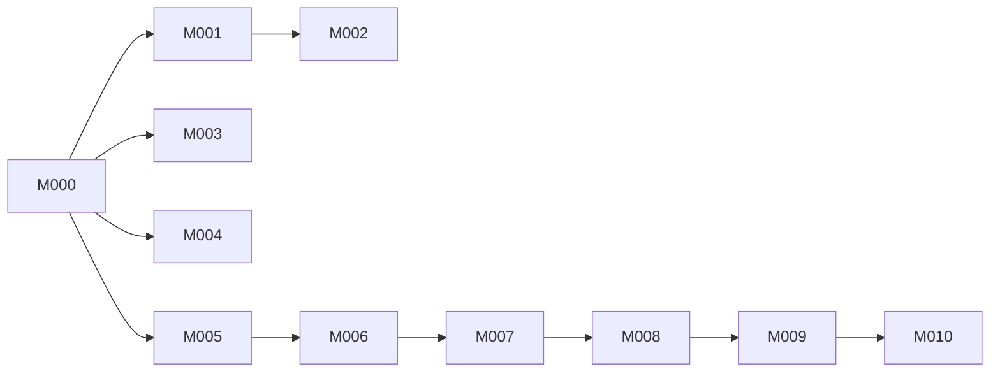

# Milestones — MercFlow

> Ordered deliveries. Each milestone groups one or more sprints.
> Updated: 2026-06-04 (S003 merged — PR #60; see `.factory/logs/sprints/S003-closeout-2026-06-04.md`)
> Updated: 2026-06-04 (synced with `development`; see `.factory/logs/milestone-reviews/M000-2026-06-04.md`)
> Updated: 2026-06-09 (M007 added — Medusa Fork Setup; ADR-007 accepted)
> Updated: 2026-06-10 (S017 merged to `development` — PRs #84 `622ad70`, #85 `f71c460`; M009 S017 done)

---

## Vision

MercFlow becomes a complete SaaS Medusa distribution: multiple shops run on one shared backend, each fully isolated by `store_id`. Every shop gets auto-maintained SEO infrastructure (redirects, sitemap, robots, structured data, Nordic slugs), a validated shopping feed for Google/Meta/TikTok, full purchase order and inventory management, and an improved order admin — all without touching code.

---

## Milestone overview

| ID | Title | Outcome | Depends on | Status |
|----|-------|---------|------------|--------|
| M000 | Tenancy Foundation | SaaS isolation safe; ready for second tenant | — | done (yellow: Neon IP HITL open) |
| M001 | SEO Infrastructure | Redirects, sitemap, robots, slug utility live | M000 | done |
| M002 | SEO Metadata | JSON-LD, OG, canonical on all pages | M001 | done (yellow: category canonical UI deferred) |
| M003 | Shopping Feed | Google/Meta/TikTok feed live and validated | M000 | done |
| M004 | Inventory & Purchase Orders | Full PO lifecycle + inventory dashboard | M000 | done |
| M005 | Improved Order Flow | Faster order processing + pick list | M000 | done |
| M006 | Production Infrastructure | MercFlow kører på Hetzner; Traefik, Redis, Sentry, provisioning | M005 | done |
| M007 | Medusa Fork Setup | Medusa som lokale workspace packages; `store_id` på core tables; tenant wiring; dashboard fjernet | M006 | done |
| M008 | Metafields | Tenant-defined metafield definitions + values; standard library; admin UI; store API | M007 | ready for milestone review |
| M009 | Product Form Polish | Unsaved state; progressive variant UX; SEO lazy preview; physical/digital toggle; product dimensions | M008 | planned |
| M010 | Fulfillment Intelligence | Merchant packaging catalog; bin-packing suggestion on order fulfillment; Shipmondo dimensions auto-fill | M009 | planned |

---

## M000 — Tenancy Foundation

**Outcome:** All MercFlow-owned tables have `store_id NOT NULL` + RLS. Guapo backfilled. Rate limiting active on public routes. Safe to onboard a second tenant.

**Progress (2026-06-04):** S001 done — T001 (#50), T002 (#52), T003 (#53). `/milestone-review M000` recorded (yellow): [review log](../logs/milestone-reviews/M000-2026-06-04.md). **Open:** Neon IP allowlist HITL — [checklist](../logs/hitl/M000-neon-allowlist.md). `shipmondo_enabled_products` backfill deferred (table optional / prod-only; not in T001 migration).

**Sprints in this milestone:**

| Sprint | Goal | Tasks |
|--------|------|-------|
| S001 | Backfill + RLS + rate limiting | T001, T002, T003 |

**Dependencies:** none — this is the root blocker.

**Guapo store_id:** `store_01KG0VBTT0714XV2CCTEBRVC47`

**Tables in scope (medusa schema):**

*MercFlow Batch 1 (10):* `article`, `category_content`, `product_content`, `cms_redirect`, `cms_global`, `media_asset`, `page`, `page_block`, `page_version`, `product_attribute`, `product_attr_link`

*Guapo-custom (7):* `brand`, `product_product_brand_brand`, `product_review`, `product_review_image`, `product_review_response`, `product_review_stats`, `guapo_free_shipping_setting`, `shipmondo_enabled_products`

Note: `payload.*` schema (PayloadCMS, Guapo storefront) is excluded — it is Guapo-specific, single-tenant by nature, not managed by MercFlow.

**Definition of done:**
- [x] All 17+ tables have `store_id NOT NULL` + composite index (11 MercFlow + 6 Guapo-custom in migration; `shipmondo_enabled_products` follow-up if present in prod)
- [x] All 4 broken unique indexes rebuilt with `store_id`
- [x] RLS enabled + `tenant_isolation` policy on all MercFlow tables
- [x] Rate limiting returns `429` after threshold on public + store routes
- [x] `pnpm migration:run` clean on local (inferred; PR #50/#52 merged, tenancy tests green)
- [x] `/milestone-review M000` recorded — **yellow** until Neon HITL closed
- [ ] Neon IP allowlist (T003 HITL) — human; see [hitl/M000-neon-allowlist.md](../logs/hitl/M000-neon-allowlist.md)

---

## M001 — SEO Infrastructure

**Outcome:** Slug changes auto-create 301 redirects. Sitemap and robots.txt fully admin-controlled. Nordic characters produce clean URLs.

**Progress (2026-06-04):** S002 merged PR #55 (`b378e22`). **S003 merged PR #60 (`b2e1d90`)** — sitemap, robots, T008 Host→store middleware, admin SEO settings, cache invalidation. Closeout: [S003-closeout](../logs/sprints/S003-closeout-2026-06-04.md).

**Sprints in this milestone:**

| Sprint | Goal | Tasks |
|--------|------|-------|
| S002 | seo-module + slug + redirects | T004, T005, T006, T007 |
| S003 | Sitemap + robots + public tenant routing | T008, T009, T010, T011, T012 |

**Dependencies:** M000

**Definition of done:**
- [x] `GET /sitemap.xml` and `GET /robots.txt` return tenant-scoped data based on `Host` header (S003, PR #60)
- [x] Slug change on product → 301 redirect auto-created (S002, PR #55)
- [x] Nordic slug strategy configurable per tenant in Settings (S002)
- [x] All public SEO/feed routes return `404` if tenant not resolved (T008 middleware)
- [ ] `/milestone-review M001` green (schedule after S004 or when M001 scope complete)

---

## M002 — SEO Metadata

**Outcome:** Structured data (JSON-LD), Open Graph, and canonical tags generated automatically on all product and category pages.

**Progress (2026-06-04):** **S004 merged PR #62 (`e9f0c6f`)** — org/JSON-LD settings, store `/store/seo/*` APIs, publishable-key tenant binding, canonical override on content. Yellow: category canonical admin UI + conflict warning deferred.

**Sprints in this milestone:**

| Sprint | Goal | Tasks |
|--------|------|-------|
| S004 | JSON-LD + OG + canonical + global config | T013, T014, T015, T016 |

**Dependencies:** M001 (seo-module foundation, tenant resolution)

**Definition of done:**
- [x] JSON-LD `Product` + `BreadcrumbList` + `Organization` + `WebSite` blocks generated per tenant
- [x] OG tags populated from SEO fields with fallbacks
- [x] Canonical auto-set; manual override works (product admin UI; category UI deferred)
- [x] No cross-tenant org data in any response (store routes bind publishable key / host)
- [ ] `/milestone-review M002` green

---

## M003 — Shopping Feed

**Outcome:** Auto-maintained Google Shopping XML feed per tenant. Validated, tenant-scoped, cache-invalidated on catalogue changes.

**Progress (2026-06-04):** S005 merged — PR #54, #57, #58. Feed routes use shared T008 middleware via seo-module (S003 merged PR #60).

**Sprints in this milestone:**

| Sprint | Goal | Tasks |
|--------|------|-------|
| S005 | feed-module + XML + admin | T017, T018, T019 |

**Dependencies:** M000 (can run in parallel with M001 after M000)

**Definition of done:**
- [x] `GET /feed/google-shopping.xml` tenant-scoped by `Host` header (T008 + feed middleware shim)
- [ ] Feed invalidated within 30s of catalogue change
- [ ] Validation report flags missing required fields
- [ ] No cross-tenant products in any feed response
- [ ] `/milestone-review M003` green

---

## M004 — Inventory & Purchase Orders

**Outcome:** Full PO lifecycle (draft → ordered → received) with supplier register. Unified inventory dashboard with live available counts.

**Sprints in this milestone:**

| Sprint | Goal | Tasks |
|--------|------|-------|
| S006 | inventory-module + suppliers + PO create | T020, T021, T022 |
| S007 | PO receive + inventory dashboard | T023, T024 |

**Dependencies:** M000

**Definition of done:**
- [ ] Admin can create PO, move through status flow, receive (partial or full)
- [ ] `Available = stocked - reserved` is live, never cached
- [ ] `Incoming` column reflects open POs
- [ ] Low-stock threshold configurable per variant
- [ ] PO-Medusa stock boundary explicit in UI and API
- [ ] `/milestone-review M004` green

---

## M005 — Improved Order Flow

**Outcome:** Faster order processing: status badges, internal notes, timeline, bulk actions, printable pick list.

**Progress (2026-06-04):** S008 merged via PR #56 (`fec137f`) — order list filters/bulk actions, internal notes, pick list.

**Sprints in this milestone:**

| Sprint | Goal | Tasks |
|--------|------|-------|
| S008 | Order list + detail + pick list | T025, T026 |

**Dependencies:** M000 (can run in parallel with M001–M004)

**Definition of done:**
- [ ] Order list has status badges, date filter, bulk fulfillment-ready action
- [ ] Order detail: notes (internal), timeline, no modal navigation
- [ ] Pick list generates and prints for today's ready-to-ship orders
- [ ] `/milestone-review M005` green

---

## Sprint ↔ task mapping

See `.factory/planning/sprints.md` and `.factory/planning/tasks.md`.

---

---

## M006 — Production Infrastructure

**Outcome:** MercFlow runs reproducibly on Hetzner. Traefik routes per-tenant domains with SSL. Redis, Sentry, BetterStack, and automated S3 backups are active. A new tenant can be provisioned in under 5 minutes via CLI script.

**PRD:** `.factory/context/PRD-infra.md`
**ADR:** ADR-006

**Sprints in this milestone:**

| Sprint | Goal | Tasks |
|--------|------|-------|
| S009 | Full infra stack + observability + provisioning + API hardening | T027, T028, T030, T031, T032 (T029 cancelled) |

**Dependencies:** Batch 2 modules stable on `development` (M000–M005 done)

**Definition of done:**
- [ ] Docker Compose stack running on Hetzner (Traefik + Medusa backend + worker + Redis + Portainer)
- [ ] Backup: Neon daily snapshots + Hetzner Server Backup enabled (see `infra/RUNBOOK.md`)
- [ ] SSL cert auto-provisioned for configured domain via Let's Encrypt
- [ ] Sentry errors tagged with `store_id`; BetterStack uptime checks active per tenant domain
- [ ] `pnpm provision-tenant` creates Store + Sales Channel + Publishable Key + Admin user in < 5 min
- [ ] Neon allowed-IP updated to Hetzner VPS egress IP (closes T003 HITL from M000)
- [ ] `infra/RUNBOOK.md` complete — second person can operate without the original author
- [ ] All MercFlow list endpoints enforce max 100 records — no unbounded queries (T031)
- [ ] All MercFlow store routes accessible under `/v1/` prefix; old paths 301-redirect (T032)
- [ ] `/milestone-review M006` green

---

---

## M007 — Medusa Fork Setup

**Outcome:** Medusa v2.14.1 kildekode lever som lokale pnpm workspace packages i monorepoet. Alle MercFlow-pakker resolver `@medusajs/*` fra forken — ikke npm. `store_id NOT NULL` tilføjet til Medusa core tables med RLS policies. `TenantIsolationSubscriber` registreret på alle module EMs ved startup. Medusa dashboard fjernet; `admin-ui` er den eneste admin-grænseflade. Zod harmoniseret til én version. `pnpm typecheck`, `pnpm build`, `pnpm test` grønne.

**PRD:** `.factory/context/PRD-fork-setup.md`
**ADR:** ADR-007

**Sprints i dette milestone:**

| Sprint | Goal | Tasks |
|--------|------|-------|
| S010 | Fork workspace + shared package | T033, T034 |
| S011 | Dashboard removal + core table store_id | T035, T036 |
| S012 | Startup tenant wiring | T037 |

**Dependencies:** M006 (done)

**Definition of done:**
- [ ] `pnpm install` — nul npm fetches for `@medusajs/*` (runtime)
- [ ] `pnpm typecheck` passes med nul nye fejl
- [ ] `pnpm build` passes
- [ ] `pnpm test` passes inkl. `test-rls-medusa.ts`
- [ ] `admin-ui → seo-module` afhængighed fjernet (`pnpm why @mercflow/seo-module --filter @mercflow/admin-ui` = 0)
- [ ] Zod: én version i lockfile
- [ ] `store_id NOT NULL` + RLS på alle 6 M0 core tables
- [ ] `TenantIsolationSubscriber` registreret og verificeret via integration test
- [ ] `@medusajs/dashboard` fjernet fra `apps/backend`
- [x] `/milestone-review M007` grøn

---

## M008 — Metafields

**Outcome:** Merchants can create tenant-scoped metafield definitions and fill values on products and categories from the admin UI — no code required. Standard library per vertical (skincare, fashion) activatable in one click. Storefront fetches metafields via publishable API key. Two-tier form UX: `is_primary` fields always visible; secondary as expandable chips.

**PRD:** `.factory/context/PRD-metafields.md`
**ADR:** ADR-008

**Sprints in this milestone:**

| Sprint | Goal | Tasks | Status |
|--------|------|-------|--------|
| S013 | metafield-module engine: definitions + values | T038, T039 | done |
| S014 | Standard library + activation + store API + category constraints | T040, T043, T044 | done |
| S015 | Admin UI: Custom Data settings + product form metafields | T041, T042 | done |
| S016 | Polish: standard library browse dialog | T045 | done |

**Dependencies:** M007 (done)

**Definition of done:**
- [x] `metafield-module` definitions + values engine with RLS (S013 — PR #77, #76)
- [x] Standard library seeds + activation API (T040 — PR #78)
- [x] Store API `GET /store/v1/metafields` with cross-tenant isolation (T044 — PR #80)
- [x] Category form metafields + category-constraint filter (T043 — PR #81)
- [x] Custom Data settings page `/settings/custom-data` (T041 — PR #79)
- [x] Product form metafields two-tier UI + batch save (T042 — PR #82)
- [x] `is_primary` always visible; secondary as `+ chip` pattern
- [x] Standard library browse dialog in settings (T045 / S016 — PR #83)
- [ ] Zero cross-tenant metafield rows (test-covered on store API; full milestone gate at review)
- [ ] Guapo brand + ingredients migrated to metafields (deferred — post-M008)
- [ ] `/milestone-review M008` grøn

**Merged to `development` (2026-06-10):**

| PR | Task | Merge |
|----|------|-------|
| #76 | T039 metafield values engine | `8df5999` |
| #77 | T038 metafield definitions engine | `f64238a` |
| #78 | T040 standard library | `0c9a02c` |
| #80 | T044 store API metafields | `e6d6eb8` |
| #81 | T043 category form metafields | `43d3cb4` |
| #79 | T041 Custom Data settings UI | `34bc047` |
| #82 | T042 product form metafields | `80b4855` |
| #83 | T045 standard library browse dialog | `93bc552` |

---

## M009 — Product Form Polish

**Outcome:** Produktformularen er hurtigere og mere fejlfri at bruge. Merchants mister ikke data ved navigation. Varianter oprettes med ét enkelt CTA. SEO preview er live og kontekstuel. Fysiske produktmål (L×W×H) er tilgængelige — prerequisite for M010.

**PRD:** `.factory/context/PRD-product-form-polish.md`

**Sprints i dette milestone:** S017, S018

**Sprints in this milestone:**

| Sprint | Goal | Tasks | Status |
|--------|------|-------|--------|
| S017 | Unsaved state indicator + SEO lazy preview | T046, T048 | done |
| S018 | Variant UX + physical product toggle + dimensions | T047, T049 | planned |

**Dependencies:** M008

**Definition of done:**
- [x] Unsaved state indicator på page title + `beforeunload` guard (T046 / S017 — PR #85)
- [ ] Varianter: enkelt CTA → grid vises kun efter option er tilføjet
- [x] SEO preview: tom tilstand = hjælpetekst; fyldt tilstand = live snippet (T048 / S017 — PR #84)
- [ ] "Physical product" toggle kollapser shipping-felter
- [ ] Dimension-felter (L/W/H/weight) synlige og persisterede per variant
- [ ] `pnpm react-doctor:admin-ui` 0 issues
- [ ] `/milestone-review M009` grøn

**Merged to `development` (2026-06-10, S017):**

| PR | Task | Merge |
|----|------|-------|
| #84 | T048 SEO lazy preview + character counters | `622ad70` |
| #85 | T046 unsaved state indicator + beforeunload guard | `f71c460` |

---

## M010 — Fulfillment Intelligence

**Outcome:** Merchant definerer deres pakke-katalog (boks-størrelser, kuverter). Under ordrebehandling foreslår systemet den optimale emballage baseret på produktdimensioner. Valgt emballage auto-udfylder Shipmondo ved label-generering.

**PRD:** `.factory/context/PRD-fulfillment-intelligence.md`

**Sprints i dette milestone:** S019, S020, S021

**Dependencies:** M009 (produktdimensioner skal være i formularen)

**Definition of done:**
- [ ] Merchant kan oprette og administrere pakke-katalog i Settings
- [ ] Order fulfillment viser foreslået emballage med utilisation-indikator
- [ ] Merchant kan acceptere eller override forslag
- [ ] Shipmondo label-generering præ-udfylder dimensioner fra valgt emballage (HITL verificeret)
- [ ] Zero cross-tenant packaging data (test-covered)
- [ ] `/milestone-review M010` grøn

---

## Dependency graph

