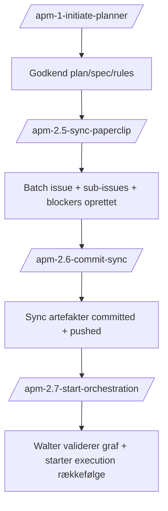

# Runbook — APM to Paperclip Execution

Dette runbook beskriver den konkrete drift fra lokal APM-planlægning til Paperclip-orchestration.

## Formål

- Behold APM lokalt som planlægnings- og auditmotor.
- Kør execution i Paperclip med issuegraph (`parent/sub-issues`, `Blocked by`, reviewer/approver).
- Start først orchestration når sync er dokumenteret og committed.

## Sekvens (v1)

## Trin-for-trin

### 1) Planlægning (lokal APM)

- Kør `/apm-1-initiate-planner`.
- Få godkendt:
  - `.apm/spec.md`
  - `.apm/plan.md`
  - relevante rules i `AGENTS.md`

Resultat: klar batch-plan.

### 2) Sync gate til Paperclip

- Kør `/apm-2.5-sync-paperclip`.
- Commanden skal oprette/align:
  - `[Batch N] ... — Orchestration` issue
  - sub-issues
  - labels
  - `Blocked by`
  - reviewer/approver
- Den skal skrive sync-rapport:
  - `.paperclip/sync/batch-N-sync.md`

Resultat: Paperclip issuegraph er klar men endnu ikke “go”.

### 3) Commit gate

- Kør `/apm-2.6-commit-sync`.
- Commit + push sync artefakter til git.

Resultat: versionsstyret snapshot af sync-state.

### 4) Orchestration kickoff

- Kør `/apm-2.7-start-orchestration`.
- Walter trigges på orchestration issue.
- Walter validerer batch/source, issuegraph, blockers og første tasks.
- Kickoff-notat skrives:
  - `.paperclip/sync/batch-N-kickoff.md`

Resultat: execution er startet sikkert.

## Operative regler

- Ingen orchestration før sync + commit gate er passeret.
- Batchnummer skal være konsistent i titel (`[Batch N]`) og label (`batch-N`).
- Når flere PRD/spec-filer findes, må Walter kun bruge den fil der er linket fra batch-epicet.
- Hvis data er uklare, stop og eskalér til menneske.

## Monitoring under execution

- Brug Paperclip issuegraph som primær driftstavle.
- Brug lokale APM artefakter til recovery, summarization og historik.
- Ved context-problemer: brug de eksisterende handoff/recover commands.

